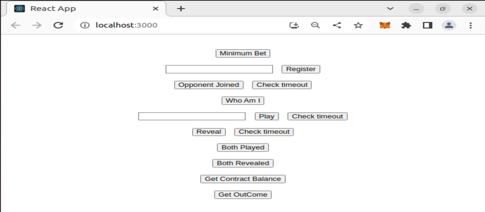
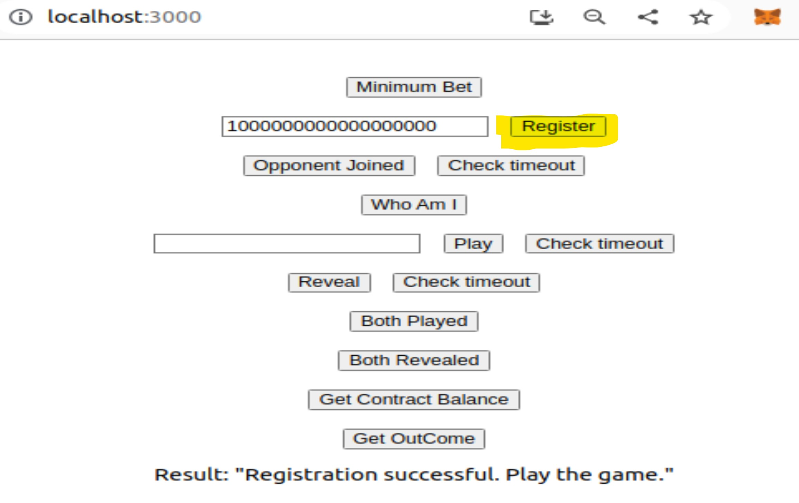
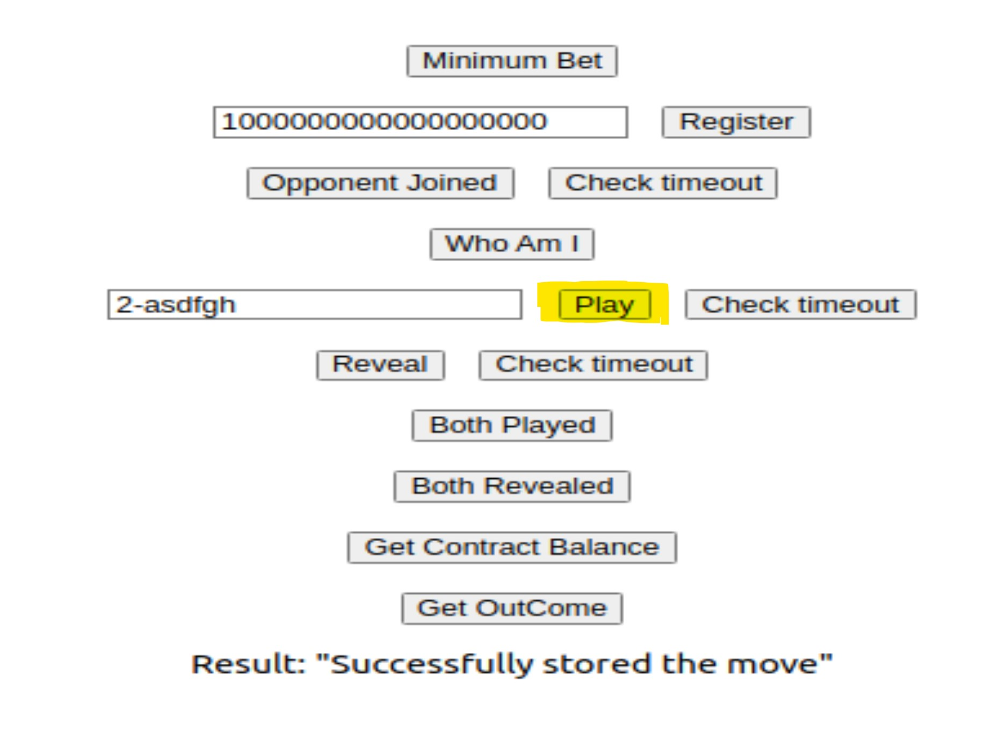
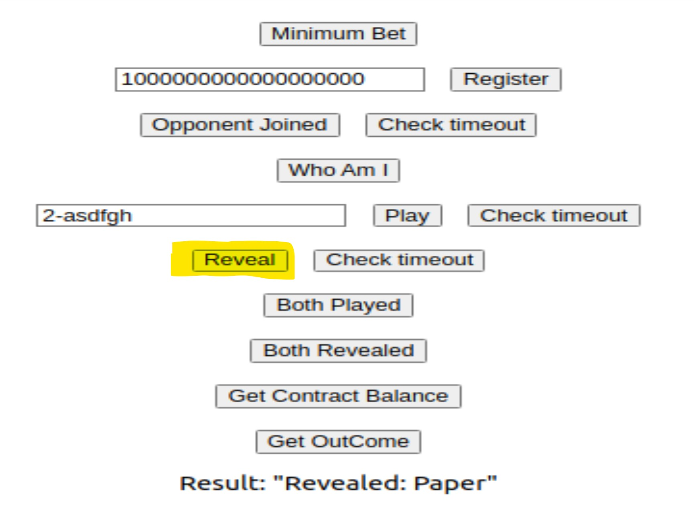
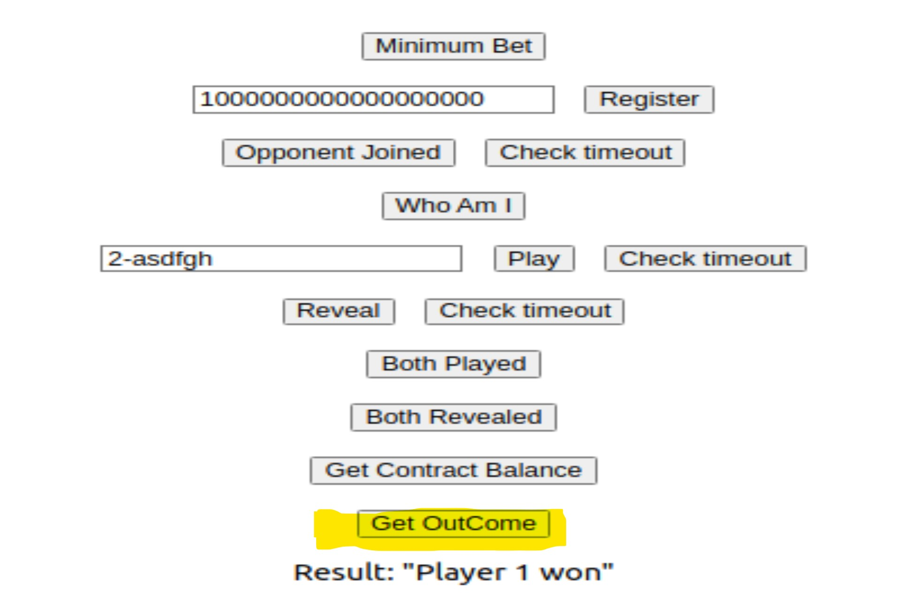

# Decentralized Rock Paper Scissors

## Contents

* [Description](#description)
* [Usage](#usage)
* [Implementation](#implementation)
    * [Registration Phase](#registration-phase)
    * [Commit Phase](#commit-phase)
    * [Reveal Phase](#reveal-phase)
    * [Result Phase](#result-phase)
    * [Helper Functions](#helper-functions)
* [How to test and run the project](#how-to-test-and-run-the-project)
* [Adversaries](#adversaries)
* [Future Work](#future-work) 

## Description
This smart contract implements Rock Paper Scissors game using Solidity. The front end application is built using React and this makes it easier for an end user to interact with the smart contract. The game follows the following sequence:
1. Players register and place a bet.
2. Each player plays their move and sends a hash of their move to the contract.
3. Once both the players played, they get to reveal their move which is compared with the previously sent hash. The contract verifies if the player's move is valid.
4. Once both the players revealed their move, the contract determines a winner and sends the bet amount to the player's account. In case of a draw, each player gets their share of the bet.
5. The game is designed in such a way that multiple 2-player games can take place simultaneously.

## Usage
1. The first step is to register the player. We use the `register()` function for this purpose. The bet amount must be greater than or equal to the minimum bet set for the game. Along with the bet value, we also check if there are two players in queue so they can start a game.
2. Commit a move by using the `play(bytes32)` function. This function expects a SHA256 hash for a given move. The moves are inputted as integers. Rock is inputted as 1, paper as 2 and scissor as 3. Since a given input always gives the same hash, this could lead to a vulnerability if the hash is known to the opponent. So, a salt is added to the integer in order to generate a randomized hash.
3. Once both the players have played their game, they can reveal their moves by using the `reveal(string memory)` function. The input given to this function is clear text. This is compared to the previously submitted hash. If both the values match, the contract marks the move as revealed and waits for the other player to reveal their move.
4. We use the `getOutcome()` function to conclude the game and the contract takes care of sending the bet amount to the winner. In case of a draw, the contract transfers the amounts back to the players.

## Implementation

### Registration Phase
A player can register using their wallet address. The React application provides a user-friendly way to interact with the smart contract. If the bet value is greater than the minimum bet set by the contract (currently 0.01 ETH), the player will be registered. 
Once a player is registered, the contract checks if there is another player waiting for an opponent. If this is the case, the contract maps both the players so they can start a game. Otherwise, the player will be put on hold until a new player joins. 
If no player shows up until 10 minutes of registration, the player gets back their bet amount from the contract.

### Commit Phase
When both the players are registered successfully, they can make a move. The `play()` function takes in a hash of the cleartext and stores it in the contract. In order to simplify this, we have used the SHA256 function in the front end to convert the cleartext that the user provides into a hash. This hash is then sent to the contract. Once a player makes a move, they can check if the opponent has played the game. If the opponent hasn't played the game for 10 minutes, the game is reset and the players get their deposit back. 
Two helper functions are used to support this usecase. The `bothPlayed()` function checks if both the players have played their game and returns a boolean value. The `checkTimeout_play()` function checks if the other player hasn't made a move within 10 minutes of the initial player's move and returns the deposit if that is the case.

### Reveal Phase
The reveal phase begins once both the players have committed their moves. A player reveals what he has played by sending their move in clear text. The contract then checks if the revealed move is same as the hash from the previous step. If they're equal, the first character of the string is stored and the contract waits for the other player to reveal their move.
If the other player doesn't reveal their move within 10 minutes, the game gets concluded with the contract deciding the transfer of balances. Two helper functions are used to support this usecase. The `bothRevealed()` function checks if both the players have reevaled their move and returns a boolean value. The `checkTimeout_reveal()` function checks if the other player hasn't revealed their move within 10 minutes of the initial player's move and transfers the bet if that is the case.

### Result Phase
When the reveal phase ends, any of the player can trigger the function `getOutcome()` to make the contract sends the rewards. The winner, if there is any, takes it all. In case of a draw, players get their bet back. A player that has not previously revealed its move has automatically lost. Once this function is called, the game is reset. This prevents any re-entrancy attacks on the contract.

### Helper Functions
At any time, players have access to public state variables and helper functions to get information about the state of the game.

Functions available are:
* `getContractBalance()`: to see the current value of the betting pool between the two players in the game.
* `whoAmI()`: to see their player's ID: 0 or 1 if they are indeed registered or 10000 if they're not.
* `bothPlayed()`: returns `true` if both players have played and that they're now able to go to the reveal phase.
* `bothRevealed()`: returns `true` if both players have revealed their move and that the contract is ready to send out the reward.
* `opponentJoined()`: returns `true` if the opponent has joined the game and set a bet amount greater than the minimum value.
* `checkTimeout_Register()`: checks if there's time left for the opponent to register before getting a timeout. In case of timeout, the bet amount is returned to the user.
* `checkTimeout_Play()`: checks if there's time left for the opponent to play before getting a timeout. In case of timeout, the bet amount is returned to the users.
* `checkTimeout_Reveal()`: checks if there's time left for the opponent to reveal before getting a timeout. In case of timeout, the bet amount is returned to the user that wins the game.

Public state variables are:
* `BET_MIN`: the minimal amount to be sent to the contract in order to register. Currently set to 0.01 ETH.

## How to test and run the project
1. Clone this repository
`git clone https://github.com/mahidharareddy/RockPaperScissors.git`
2. Install Foundry and start anvil to run a local blockchain.
`anvil`
3. If the code is modified depending on your requirements, use forge to create a new contract and modify the contract address in the MyComponent.js file.
`forge create --rpc-url http://localhost:8545 --private-key <private-key>  src/RockPaperScissors.sol:RockPaperScissors`
4. Also, generate an ABI if the solidity code is modified, and paste this in the MyComponent.js file.
5. Navigate to the front end application folder and install all dependencies.
`npm install`
6. Now start the server.
`npm start`
7. Now the application can be opened and tested. This uses a metamask extension, so make sure you have the extension installed on the browser.
`https://127.0.0.1/8545`

## Adversaries
If the players play the game with a bet amount that is exceptionally high, there is a risk of miners delaying the transaction for their own benefit. Since the inclusion of transactions on a block is in the hands of miners, they could be playing as an opponent in the game and prevent the other player's transaction from being included in the block. Since we used the timeout mechanism which uses the latest mined block's timestamp, there is a risk of the genuine player failing to get their transaction approved even though they submit their move within the specified time.

## Future Work
The game could be modified to make use of state channels. State channels are a technique for performing transactions and other state updates “off chain”. Using the state channels, the players can get benefitted from paying huge gas fee for every move they make on chain. Both the players can start and play their game off-chain. This can reduce transaction costs and enhance faster transactions whilst maintaining the security equivalent to on-chain. In case of any conflicts, the players could always fall back to on-chain as the smart contract is deployed there. They can get their conflicts or issues resolved using the main chain. 

